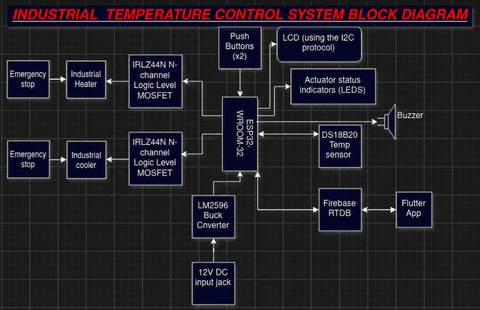
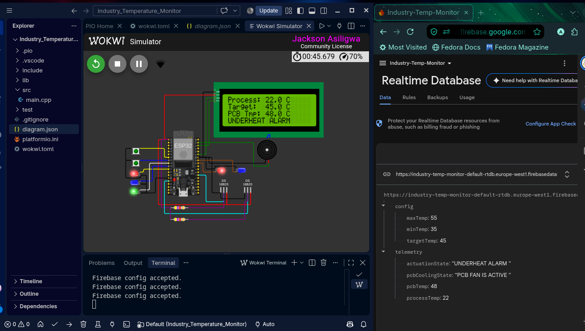
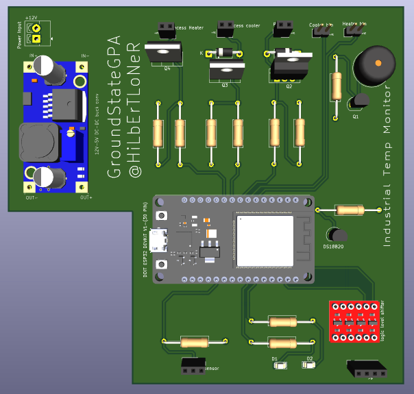
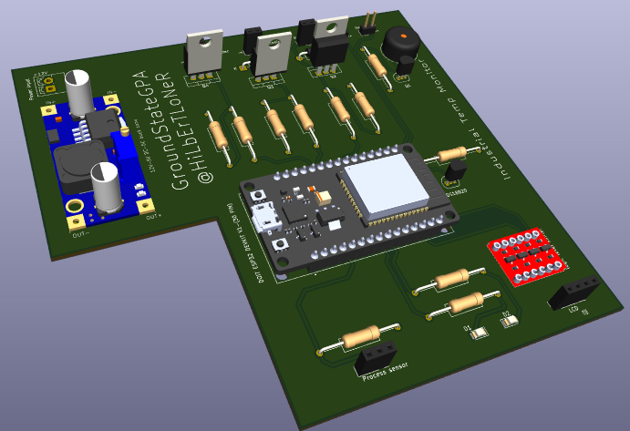
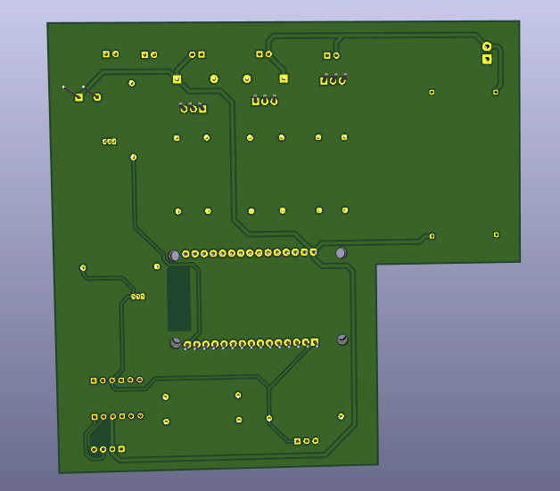
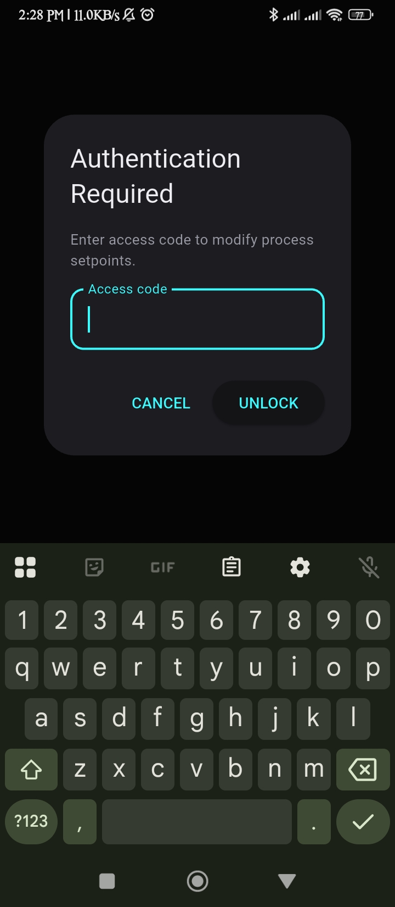
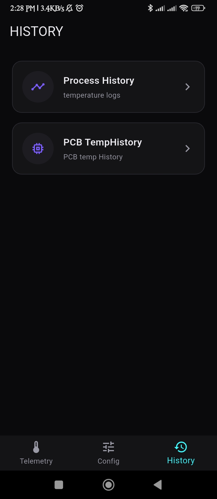
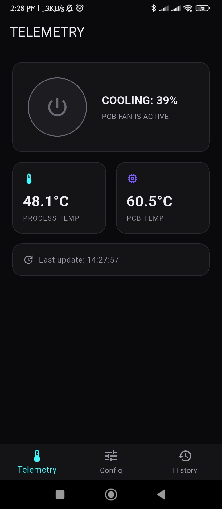

# Industrial Temperature Monitor

A complete, full-stack engineering project encompassing Firebase Real Time Database,custom printed circuit board (PCB) design, embedded C++ firmware ,simulations and a Flutter mobile application. 

The system provides closed-loop temperature monitoring and PWM hardware actuation, synchronized globally with sub-second latency via Firebase Realtime Database (RTDB).

## System Architecture

The project is structured as a monolithic repository integrating three distinct engineering domains:

    industry_temperature_control/
    ├── hardware/     # KiCad EDA (Schematics, PCB layout, Gerbers)
    ├── firmware/     # PlatformIO C++ (ESP32 logic, RTDB sync)
    ├── software/     # Flutter Mobile App (Clean Architecture, Riverpod, Hive)
    └── docs/         # System architecture, renders,wokwi simulation and media assets

### High-Level Topology

*Validation: Real-time synchronization between the ESP32 hardware simulation and the Firebase RTDB backend.*

---

## Hardware (KiCad)
The physical controller is a custom 2-layer PCB designed to handle both high-current 12V industrial loads and sensitive 3.3V digital logic.

**Core Specifications:**
* **Microcontroller:** DOIT ESP32 DEVKIT V1 -30 pin
* **Power Delivery Network (PDN):** 12V main input, regulated to 5V via an onboard LM2596 Buck Converter. High-current traces routed at 0.8mm width.
* **Logic Level Translation:** BOB-12009 bidirectional shifter (5V ↔ 3.3V) for I2C LCD communication.
* **Sensors & Actuators:** DS18B20 (1-Wire) digital temperature sensor, with MOSFET-driven PWM outputs for external fans and heating lamps.
* **Trace Topology:** 0.4mm logic lines routing across Top/Bottom copper planes with continuous ground pours for EMI shielding.

  
  
  

---

## Firmware (PlatformIO & Wokwi)
Written in C++ for the ESP32, the firmware manages real-time hardware interrupts, sensor polling, and network communication. 

**Key Features:**
* **Hardware Debouncing:** 200ms software debouncing for mechanical inputs.
* **Delta-Driven Telemetry:** Pushes raw JSON string payloads to the `/telemetry` RTDB node to minimize bandwidth (Tracking `processTemp`, `pcbTemp`, `actuationState`, and `pcbCoolingState`).
* **Config Listener:** Subscribes to the `/config` RTDB node to dynamically update operational setpoints (Target, Max, Min limits) pushed from the mobile app.

### Hardware Simulation
*A live capture of the logic execution in Wokwi:*

---

## Software (Flutter Mobile App)
A mobile frontend built for performance.

**Technical Stack & Architecture:**
* **Architecture:** Strict Clean Architecture (Data, Domain, Presentation layers) utilizing Domain Use Cases to enforce boundary separation.
* **State Management:** Fully manual Riverpod (`AsyncNotifier` and `StreamProvider`), ensuring memory-safe stream disposal without code generation overhead.
* **Data Layer:** Direct Firebase RTDB streams (zero FCM/push notifications) for real-time telemetry, and Hive local storage mapping raw strings for history logging.
* **UI/UX:** Custom state-based routing, dynamic implicit animations driven by hardware states, and a Vantablack/charcoal design system.

  
  
  

---

## Getting Started

**To view the Hardware:**
1. Install KiCad 10.0+.
2. Open `hardware/industry_temperature_control.kicad_pro`.

**To compile the Firmware:**
1. Open the `firmware/` directory in VS Code with the PlatformIO extension installed.
2. Create your firebase project and manually add your database URL and API_KEY-I removed mine for security purposes.
3. Build the environment to pull the required C++ dependencies.

**To run the Mobile App:**
1. Navigate to the `software/` directory.
2. Use your own firebase URL,the RTDB structure is already defined in the README.md of the software folder,you only need to create the Firebase project and create the nodes as they appear in the README.md in the software folder.
3. Run `flutterfire configure` command to configure your flutter app to the Firebase project.
4. Run `flutter pub get`.
5. Provide your own `google-services.json` (Android) from your Firebase console.
6. Run `flutter run`.

---
*Designed and engineered by Jackson Asiligwa*
